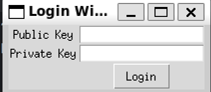
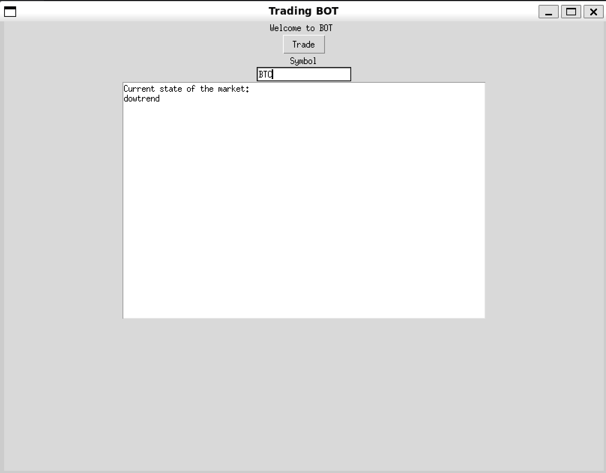

# python-trading-app

## Motivation

This project is for the final term exam in the Japanese Technology Topic Subject.

## Features

- Train an AI model based on Binance data for cryptocurrency predictions.
- Select the most accurate model for real-time trading.
- Automate trading for gaining money.





## Prerequisites

- Minicoda3: See install [instruction](https://docs.anaconda.com/miniconda/install/#quick-command-line-install).
- ```talib``` for viewing diagrams: See
  install [instruction](https://medium.com/@outwalllife001/how-to-install-ta-lib-on-ubuntu-22-04-step-by-step-88ffd2507bbd).
- Ubuntu 22.04 for optimal performance.
- ```python3``` or ```python3.9```.
- A Binance account with cryptocurrency funds.

## Instructions

- Clone this repository.
- Run the command: ```python3 main.py```.
- Log in using your Binance wallet's private key and public key.
- Enter the token you want to trade.
- Press "Trade" button and wait the results.

## Improvements

- Enhanced UI.

## Contributors

- Trần Mạnh Duy 22026567
- Phạm Khánh Linh 21020080